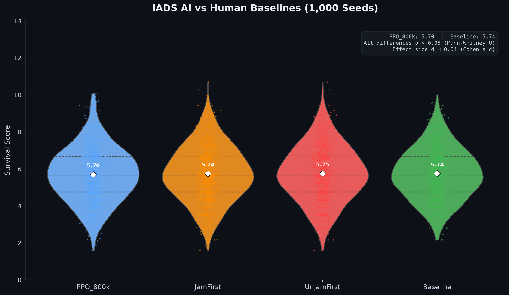

# Integrated Air Defense System (IADS) Simulator

A real-time air defense simulation framework with reinforcement learning (PPO) training, a WebSocket bot API, and a React-based command center UI. Designed for modeling multi-domain engagement scenarios — radar sweeps, jamming, swarms, interceptor guidance, and policy-driven threat prioritization — with the ability to train, evaluate, and compare air defense AI agents.

The project demonstrates a complete ML + systems engineering pipeline: a discrete-event simulation engine, a Gymnasium RL environment, a Stable-Baselines3 PPO training loop, a 1,000-seed tournament evaluation framework, and a Tauri desktop application with a real-time tactical display.

---

## Features

### Simulation Engine
- Real-time 2D simulation of hostile tracks, interceptors, radar sweeps, and engagement physics
- Proportional Navigation guidance for interceptor missiles
- Radar model with configurable detection cones, jamming noise, track flicker, and multi-site sweeps
- Swarm and jammer track types with distinct behavioral characteristics
- Configurable scenarios (hostile count, jamming intensity, threat speed, spawn patterns)

### AI & Policies
- **Reinforcement Learning** via Stable-Baselines3 PPO with a Gymnasium environment
- Discrete(16) action space with observation encoding (15 threat candidates × 8 features + 5 defense features)
- Three hand-crafted heuristic policies for baseline comparison:
  - **Baseline** — greedy nearest-threat heuristic
  - **JamFirst** — prioritizes jamming threats first
  - **UnjamFirst** — delays jamming engagements for higher PK
- Policy comparison framework with paired lockstep simulation for head-to-head evaluation
- 1,000-seed tournament framework with statistical significance testing

### Real-Time Control
- **WebSocket Bot API** for connecting external AI agents to live simulation state
- FastAPI server streaming JSON state snapshots at ~60 Hz
- Runtime policy switching, pause/resume/step, and speed control
- Sidecar backend managed by Tauri for desktop deployments

### User Interface
- React + TypeScript + Vite tactical display with canvas-based PPI/A-SCOPE/B-SCOPE radar views
- Real-time track list, threat assessment, interceptor status, and event feeds
- Side-by-side policy comparison view
- Tauri desktop wrapper with system tray integration
- Proportional Navigation trajectory prediction overlay

---

## Tech Stack

| Layer | Technology |
|---|---|
| Simulation Engine | Python 3.10+, NumPy |
| RL Training | Stable-Baselines3 (PPO), Gymnasium |
| API Server | FastAPI, Uvicorn, WebSockets |
| Desktop (Legacy) | PyQt6, Pyqtgraph |
| Frontend | React 18, TypeScript, Vite 6, Tailwind CSS, Zustand |
| Desktop (Modern) | Tauri 2, Rust |
| Build | PyInstaller (server binary), Vite (frontend) |
| Testing | pytest |
| Data | JSON (tournament results), NumPy arrays (model weights) |

---

## Quick Start

### Prerequisites

- Python 3.10+
- Node.js 18+
- Rust toolchain (optional, for Tauri desktop builds)

### Backend Setup

```powershell
# Create virtual environment
python -m venv venv
.\venv\Scripts\Activate.ps1

# Install Python dependencies
pip install -r backend/requirements.txt
```

### Frontend Setup

```powershell
cd frontend
npm install
cd ..
```

### Running (Development)

```powershell
# Terminal 1: Start the backend server
python backend/server.py

# Terminal 2: Start the Vite dev server
cd frontend
npm run dev
```

Open http://localhost:3000 in your browser. The backend runs on port 8000.

### Running (Desktop)

```powershell
.\run.bat
```

This builds the frontend, starts the backend server, and launches the Tauri desktop window.

### Running the Tournament

```python
import sys
sys.path.insert(0, 'backend')

from simulation.tournament import Tournament
from simulation.policies import BaselinePolicy
from simulation.trained_policy import TrainedPolicy

t = Tournament(num_runs=100)
t.register('PPO', lambda: TrainedPolicy('backend/simulation/models/ppo_iads.zip'))
t.register('Baseline', BaselinePolicy)
t.run()
t.save_html('report.html')
t.save_csv('results.csv')
```

### Training a PPO Agent

```powershell
# From repository root (with venv activated)
python -m simulation.train_sb3 --timesteps 1000000

# Or use the convenience script
.\training\run_training.ps1
```

---

## Architecture Overview

```
┌─────────────────────────────────────────────────────────┐
│                    Entry Points                          │
│  run.bat ── desktop.py ──┐                              │
│  main.py ────────────────┼── Legacy PyQt6 Desktop App   │
└──────────────────────────┴──────────────────────────────┘
                           │
┌──────────────────────────▼──────────────────────────────┐
│              Backend Server (FastAPI)                     │
│  server.py ── simulation_runner.py                       │
│                    │                                      │
│         ┌──────────▼──────────┐                           │
│         │  simulation/        │                           │
│         │  simulator.py       │  Core physics loop       │
│         │  physics.py         │  Tracks, interceptors,   │
│         │  radar.py           │  radar, engagement       │
│         │  policies.py        │  Heuristic policies      │
│         │  trained_policy.py  │  PPO model wrapper       │
│         │  tournament.py      │  Multi-seed evaluation   │
│         │  gym_env/env.py     │  RL training env         │
│         │  train_sb3.py       │  Training script         │
│         └─────────────────────┘                           │
└──────────────────────────────────────────────────────────┘
                           │
┌──────────────────────────▼──────────────────────────────┐
│  Frontend (React + Vite + Tailwind)                      │
│  ┌──────────────────────────────────────────────────┐    │
│  │  TacticalDisplay  │  PPI / A-SCOPE / B-SCOPE    │    │
│  │  TrackList        │  ThreatLog / EventFeed      │    │
│  │  SimulationControls │  ScenarioControls         │    │
│  │  PolicyComparison │  PolicySelector             │    │
│  │  TimelineReplay   │  SectorAnalysis             │    │
│  └──────────────────────────────────────────────────┘    │
│  State: Zustand store (useSimStore)                       │
│  Hooks: useSimulation, useComparisonBackend              │
└──────────────────────────────────────────────────────────┘
```

### Backend Simulation Engine

The core simulation (`backend/simulation/simulator.py`) runs a discrete-event physics loop managing hostile tracks, interceptor missiles (Proportional Navigation), radar sweeps, and engagement resolution. Track types include STANDARD, JAMMER (degraded PK), and SWARM (coordinated groups). The simulation is fully deterministic given a seed.

### PPO Policy

The PPO agent (`backend/simulation/trained_policy.py`) wraps a Stable-Baselines3 model. It observes up to 15 threat candidates with 8 normalized features each (position, velocity, ETA, jammed/swarm flags, bias) plus 5 defense features (inventory, in-flight, capacity). The Discrete(16) action space maps to engaging a specific candidate or taking no-op.

### WebSocket Server

FastAPI (`backend/server.py`) exposes WebSocket endpoints (`/ws/sim`, `/ws/compare`) and REST endpoints (`/api/status`). The `SimulationRunner` wraps the simulation in a background thread with a command queue, streaming state snapshots at ~60 Hz.

### Policy Comparison

`ComparisonCoordinator` runs two simulations in lockstep with identical random seeds, each using a different policy. The paired snapshots enable bias-free head-to-head comparison of engagement behavior, kill counts, leakers, and resource utilization.

---

## Project Structure

```
backend/
  simulation/              # Core simulation engine (Python package)
    __init__.py
    simulator.py            # Main Simulation class — physics loop
    physics.py              # Track, Interceptor (PN), Explosion, MissMarker
    radar.py                # Radar (multi-site, jamming, noise)
    policies.py             # BaselinePolicy, PriorityPolicy, JamFirst/UnjamFirst
    trained_policy.py       # PPO model wrapper (SB3)
    observation_encoder.py  # RL observation encoding
    tournament.py           # Multi-seed tournament framework
    scenario_generator.py   # Scenario configuration generator
    train_sb3.py            # PPO training script
    gym_env/                # Gymnasium RL environment
      __init__.py
      env.py                # IADSGymEnv — action space, reward, step
    models/                 # Intermediate PPO checkpoints
  models/                   # Versioned safe PPO model checkpoints
  server.py                 # FastAPI WebSocket + HTTP server
  simulation_runner.py      # Background simulation thread with command queue
  comparison_coordinator.py # Lockstep A/B policy comparison
  compare_policies.py       # CLI script for batch policy comparison
  requirements.txt
  tests/                    # pytest test suite
    test_trained_policy.py
    test_observation_encoder.py
    test_comparison_coordinator.py
    test_integration.py
controller/                 # Legacy PyQt6 desktop app controller
model/                      # Legacy PyQt6 desktop app model
view/                       # Legacy PyQt6 desktop app view
frontend/                   # Web-based UI (React + TypeScript + Vite + Tailwind)
  package.json
  vite.config.ts
  index.html
  src/
    main.tsx                # App entry point
    App.tsx                 # Main app component
    types.ts                # TypeScript type definitions
    theme.ts                # Visual theme constants
    store/simulationStore.ts  # Zustand state management
    hooks/                  # Custom React hooks
    renderer/               # Canvas drawing functions
    components/             # UI components (22 files)
    data/mockSimulation.ts  # Standalone simulation data generator
  src-tauri/                # Tauri desktop wrapper (Rust)
    Cargo.toml
    src/main.rs, lib.rs
    tauri.conf.json
    icons/
training/                   # RL training scripts
  run_training.ps1
evaluation/                 # Tournament results and analysis data
  tournament_results/
    tournament_stats_1000/
      summary.json
      all_scores.json
docs/                       # Project documentation
  ARCHITECTURE.md
  TRAINING.md
  EVALUATION.md
  CONTRIBUTING.md
  BOT_API.md
  protocol-schema.json
```

---

## Reinforcement Learning Results

After 800,000 steps of PPO training, the AI agent achieves **statistical parity** with all three hand-crafted heuristic policies. Evaluated over a 1,000-seed tournament (4,000 total simulations):

| Policy | Mean Score | Median | Std Dev | vs Baseline |
|---|---|---|---|---|
| PPO_800k | 5.70 | 5.67 | 1.45 | p > 0.05, d = 0.03 |
| JamFirst | 5.74 | 5.67 | 1.47 | p > 0.05 |
| UnjamFirst | 5.75 | 5.67 | 1.48 | p > 0.05 |
| Baseline | 5.74 | 5.67 | 1.37 | — |



**Key findings:**
- PPO mean score (5.70) differs from Baseline (5.74) by only 0.04 points
- No pairwise comparison reaches statistical significance (Mann-Whitney U, all p > 0.05)
- Effect sizes are negligible (Cohen's d < 0.04 for all comparisons)
- The PPO model was trained with a Discrete(16) action space, normalized observations, and a shaped reward function (+1 per kill, −10 per leaker, −0.1 per miss)

---

## Screenshots

> **TODO:** Add screenshots of the tactical display, PPI/A-SCOPE/B-SCOPE radar views, policy comparison panel, and desktop application.

| View | Preview |
|---|---|
| Tactical Display | `<!-- TODO: screenshot of main tactical view -->` |
| Policy Comparison | `<!-- TODO: screenshot of side-by-side comparison -->` |
| Radar Displays | `<!-- TODO: screenshot of PPI / A-SCOPE / B-SCOPE -->` |

---

## Documentation

| Document | Description |
|---|---|
| [Architecture](docs/ARCHITECTURE.md) | System architecture overview, component dependency map |
| [Training Guide](docs/TRAINING.md) | RL environment, action space, reward function, CLI usage |
| [Evaluation](docs/EVALUATION.md) | Tournament framework, policy descriptions, results |
| [Contributing](docs/CONTRIBUTING.md) | Development setup, code organization, PR guidelines |
| [Bot API](docs/BOT_API.md) | WebSocket protocol reference with Python examples |
| [Protocol Schema](docs/protocol-schema.json) | JSON schema for server-client state and control messages |

---

## Roadmap

- [ ] **Unify simulation models**: Merge legacy PyQt6 `model/simulation.py` with `backend/simulation/` or retire the desktop app
- [ ] **Add license file**: Choose and add an open-source license
- [ ] **CI/CD pipeline**: GitHub Actions with automated testing and linting
- [ ] **Expand test coverage**: Unit tests for simulator, physics, radar, and policies
- [ ] **Additional RL algorithms**: Experiment with DQN, SAC, or A2C
- [ ] **Scenario difficulty levels**: Easy / medium / hard / extreme presets
- [ ] **Multi-player mode**: Multiple external agents competing in the same simulation
- [ ] **Export / replay**: Save simulation traces for post-hoc analysis
- [ ] **WebAssembly frontend**: Compile simulation engine to WASM for client-side execution

---

## License

> **TODO:** This project does not currently have a license file. A license should be added before public distribution.

---

## Bot API Quick Reference

External AI agents can connect to the simulation server in real time via WebSocket:

```python
import asyncio
import json
import websockets

async def main():
    async with websockets.connect("ws://127.0.0.1:8000/ws/sim") as ws:
        state = await ws.recv()
        await ws.send(json.dumps({"action": "engage", "track_id": 42}))
        async for msg in ws:
            data = json.loads(msg)
            print(f"Tracks: {len(data.get('tracks', []))}")

asyncio.run(main())
```

See [docs/BOT_API.md](docs/BOT_API.md) for the full protocol reference, available policies, and detailed Python examples.
